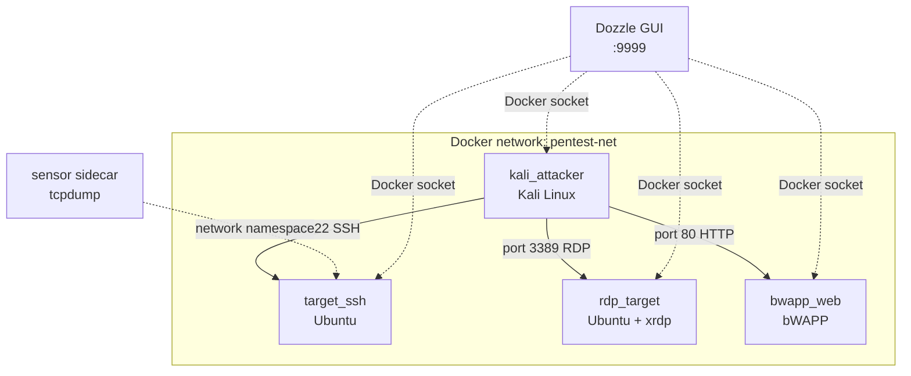

# BootCon Cybersecurity Lab (2026 Branch)

[](https://github.com/kazichaska/cybersecurity-bootcon-project/actions/workflows/lab-quality.yml)
[](https://www.python.org/)
[](LICENSE)
[](https://vscode.dev/redirect?url=vscode://ms-vscode-remote.remote-containers/cloneInVolume?url=https://github.com/kazichaska/cybersecurity-bootcon-project)

Hands-on, containerized cybersecurity lab for learning and practicing offensive + defensive workflows in a controlled environment.

## Why this branch

- Modernized Python automation scripts with safer subprocess handling and CLI arguments
- Improved lab verification workflow with explicit health checks
- CI quality gates (lint, syntax, and Ansible checks)
- Cleaner onboarding path for students, instructors, and self-learners

## Core capabilities

| Scenario | Difficulty | Est. Time | MITRE ATT&CK |
|---|---|---|---|
| SSH brute-force + hardening | Beginner | 25 min | [T1110.001](https://attack.mitre.org/techniques/T1110/001/) |
| RDP brute-force + account lockout | Beginner | 20 min | [T1021.001](https://attack.mitre.org/techniques/T1021/001/) |
| Web attacks: XSS + SQLi via bWAPP | Beginner | 30 min | [T1059.007](https://attack.mitre.org/techniques/T1059/007/) |
| Exploit → harden → re-test (remediation) | Intermediate | 35 min | T1110 + M1036 |

## Lab topology



## Quick start

1. Start Colima and select its Docker context:

	```bash
	colima start
	docker context use colima
	```

2. Install Python dependencies:

	```bash
	pip install -r ssh-brute-lab/requirements.txt
	```

3. Run environment preflight checks:

	```bash
	python labctl.py doctor
	```

4. Deploy full lab:

	```bash
	python labctl.py setup
	```

	Setup automatically writes an HTML report to `reports/`. To open it (lightweight "GUI" view):

	```bash
	python labctl.py setup --open
	```

5. Verify readiness:

	```bash
	python labctl.py verify
	```

6. Clean up when finished:

	```bash
	python labctl.py cleanup
	```

	Cleanup automatically writes an HTML report to `reports/`. To open it:

	```bash
	python labctl.py cleanup --open
	```

## One-command operations

- `python labctl.py setup` — deploy all lab targets
- `python labctl.py verify` — run health checks
- `python labctl.py attack-ssh -- --target target_ssh --username root` — run SSH workflow in Kali
- `python labctl.py attack-rdp -- --target rdp_target --username admin` — run RDP workflow in Kali
- `python labctl.py shell` — open an interactive shell in `kali_attacker`
- `python labctl.py lesson --track ssh` — guided instructor/student flow with prompts + expected outputs
- `python labctl.py lesson --track ssh --run` — execute each lesson step automatically
- `python labctl.py lesson --track web --run` — web attack lesson (XSS + SQLi via bWAPP)
- `python labctl.py lesson --track remediate --run` — exploit → harden → re-test cycle
- `python labctl.py cleanup` — tear down lab
- `python labctl.py harden` — apply remediation/hardening (post-lesson)
- `python labctl.py gui --up --open` — open a simple GUI to view container logs live
- `python labctl.py scan --type fs` — supply-chain scan (repo) with Trivy
- `python labctl.py scan --type images` — supply-chain scan (lab images) with Trivy

### CTF mode (challenge exercises)

Plant a flag in a target container and challenge students to capture it:

```bash
# Plant flag + print objective
python labctl.py ctf --track ssh --setup

# Student submits after exploiting the target
python labctl.py ctf --track ssh --check CTF{...}
```

Tracks available: `ssh`, `rdp`, `web`

### Knowledge quizzes

5 multiple-choice questions per track with a scored HTML report:

```bash
python labctl.py quiz --track ssh
python labctl.py quiz --track rdp
python labctl.py quiz --track web
python labctl.py quiz --track remediate
```

## Makefile shortcuts

If you prefer Make targets:

```bash
make doctor
make setup
make verify
make lesson
make lesson-run
make lesson-web
make cleanup
make report
make setup-report
make cleanup-report
make gui-open
make harden-open
make scan-fs
make ctf-ssh
make quiz-ssh
```

## Reports (HTML)

- Reports are written to `reports/` (ignored by git).
- Generate a standalone status report anytime:

	```bash
	python labctl.py report --open
	```

## Defensive network audit (optional)

For learners who want to inventory their own home/small-business lab network (authorized use only):

```bash
python3 labctl.py audit --targets 192.168.1.0/24 --mode discovery --yes --open
```

See [network-audit/README.md](network-audit/README.md).

## Live GUI (optional)

To let learners see what’s happening (live container logs in a browser):

```bash
python3 labctl.py gui --up --open
```

See [defense-stack/README.md](defense-stack/README.md).

## Detection lab (optional)

Capture traffic signals to a target container and generate an HTML report:

```bash
python3 labctl.py detect --container target_ssh --seconds 90 --open
```

See [detection-lab/README.md](detection-lab/README.md).

## Remediation (optional)

After completing lessons, apply hardening and re-test:

```bash
python3 labctl.py harden --open
python3 labctl.py lesson --track remediate --run
```

## Learning resources

Concept cards in [`docs/concepts/`](docs/concepts/) give short plain-English explanations for learners:

- [SSH Brute-Force](docs/concepts/ssh-brute-force.md) — how it works, indicators, defenses
- [fail2ban](docs/concepts/fail2ban.md) — automated IP blocking after auth failures
- [Why Password Auth Is Weak](docs/concepts/why-password-auth-is-weak.md) — keys vs passwords
- [RDP Brute-Force](docs/concepts/rdp-brute-force.md) — RDP attack patterns and mitigations
- [Web Attacks: XSS + SQL Injection](docs/concepts/web-attacks.md) — OWASP Top 10 essentials

For instructors running a class or workshop: [docs/instructor-guide.md](docs/instructor-guide.md)

## Supply chain scanning (optional)

```bash
python3 labctl.py scan --type fs --open
```

## If `make setup` fails on Docker socket

If you see errors referencing `FileNotFoundError` or `/var/run/docker.sock`, ensure Colima is active and selected:

```bash
colima start
docker context use colima
python labctl.py doctor
```

Then retry:

```bash
make setup
```

## Practice scripts (inside Kali)

- SSH flow: `python3 /opt/lab/ssh-bruteforce.py --help`
- RDP flow: `python3 /opt/lab/rdp-bruteforce.py --help`

## Ethical use

Use this project only in environments you own or are explicitly authorized to test. Do not run these workflows against public or unauthorized systems.

See contribution and policy docs:

- [CONTRIBUTING.md](CONTRIBUTING.md)
- [SECURITY.md](SECURITY.md)

## Development quality checks

Run locally:

```bash
pip install -r requirements-dev.txt
ruff check .
python -m compileall -q verify-lab.py ssh-brute-lab/ansible/scripts
ansible-playbook --syntax-check ssh-brute-lab/ansible/lab/lab-setup.yml
```


